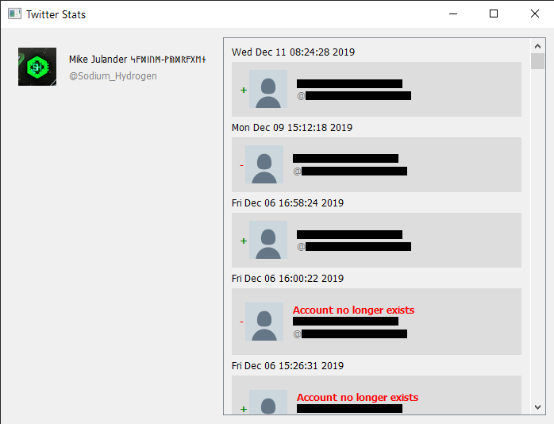

# Twitter Tracker #
This is built to identify and enumerate all changes in twitter follower count.
 
I mostly wanted to know when someone stopped following my account if it was because they chose to or their account 
was deleted or banned.
  

 
Twitter does not keep historical data on follower changes so this will only be able to track changes from when it
first started running on your account. When a deleted account is found it marks all occurences of that account as no longer exsisting.
## By using this software you agree not to be creepy or evil or act on the information in any way that would make people unhappy with you ##
This is built using Qtv5 and libcurl and is currently in beta.
 
At this time I have no plans of releasing the source code for the custom api provided on my site.
